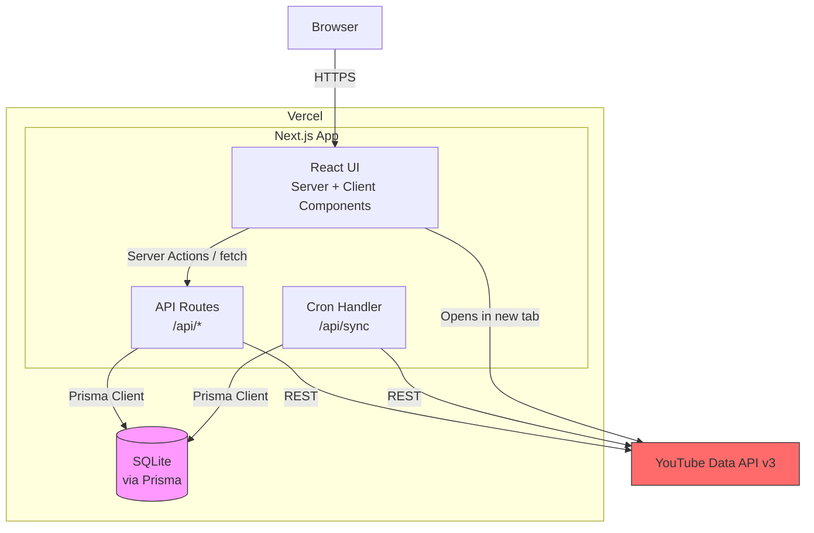
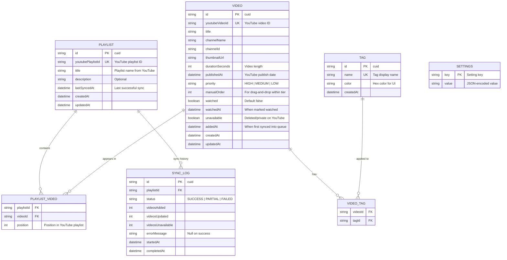

# YouTube Queue — Technical Architecture

## Stack Overview

| Layer | Choice | Rationale |
|-------|--------|-----------|
| **Framework** | Next.js 14+ (App Router) | You already know React/Next.js. App Router gives us Server Components for fast data fetching, API Routes for the backend, and a single deployable unit. No need for a separate NestJS backend — this is a personal tool, not an enterprise API. |
| **Language** | TypeScript | Non-negotiable for a solo dev. Catches bugs at compile time, self-documents the codebase. |
| **Database** | SQLite via Prisma | Zero ops overhead. No database server to manage. Prisma gives you type-safe queries and migrations. For a single-user app with maybe 1,000-5,000 videos, SQLite handles this without breaking a sweat. |
| **ORM** | Prisma | Type-safe database access, auto-generated client, clean migration story. Pairs perfectly with TypeScript. |
| **Styling** | Tailwind CSS | Fast to build with, responsive out of the box, no CSS architecture decisions needed. You can make it look good without a design system. |
| **UI Components** | shadcn/ui | Copy-paste component library built on Radix primitives. Gives you accessible, well-designed components (dialogs, dropdowns, toasts, data tables) without a heavy dependency. |
| **Deployment** | Vercel | Best-in-class Next.js hosting. Free tier covers this use case. Edge Functions for API routes. Cron jobs for scheduled sync. |
| **External API** | YouTube Data API v3 | Only external dependency. API key for public playlists. |

### Why Not NestJS + PostgreSQL?

Your usual stack is overkill here. NestJS shines for multi-developer enterprise APIs with complex business logic, dependency injection, and microservice patterns. YouTube Queue is a single-user CRUD app with one external integration. The overhead of maintaining two deployable services (frontend + backend) and a managed PostgreSQL instance isn't justified. Next.js API Routes give you everything you need in one codebase, one deployment.

If this ever grows beyond personal use, migrating from SQLite to PostgreSQL via Prisma is a schema change + connection string swap — not a rewrite.

---

## System Diagram



**Data flow is dead simple:** Browser → Next.js (serves UI + handles API) → SQLite for persistence, YouTube API for sync. No queues, no cache layers, no message brokers. One process, one database file.

---

## Data Model



### Key Design Decisions

**Videos are independent of playlists.** A video can appear in multiple playlists. The `PLAYLIST_VIDEO` join table tracks which playlist(s) a video came from, but the video's priority, tags, and watch status are properties of the video itself — not the playlist.

**`youtubeVideoId` is unique but not the primary key.** Using a cuid as PK keeps internal references stable even if YouTube changes something. The YouTube ID is a unique index for dedup during sync.

**`SETTINGS` is a key-value table.** Stores app config: sync interval, scoring weights, API key, playlist IDs to sync. Avoids a rigid config schema for a personal tool that'll evolve.

**`SYNC_LOG` tracks sync history.** Useful for debugging quota issues and knowing when the last successful sync ran.

### Indexes

```sql
-- Core query: unwatched videos, sorted by score
CREATE INDEX idx_video_watched ON video(watched);
CREATE INDEX idx_video_priority ON video(priority);
CREATE INDEX idx_video_added_at ON video(addedAt);

-- Dedup during sync
CREATE UNIQUE INDEX idx_video_youtube_id ON video(youtubeVideoId);
CREATE UNIQUE INDEX idx_playlist_youtube_id ON playlist(youtubePlaylistId);

-- Tag filtering
CREATE INDEX idx_video_tag_video ON video_tag(videoId);
CREATE INDEX idx_video_tag_tag ON video_tag(tagId);
```

---

## API Design

Next.js API Routes using the App Router convention (`app/api/`). RESTful because it's the simplest thing that works for CRUD operations on a handful of resources.

### Playlists

| Method | Endpoint | Description |
|--------|----------|-------------|
| `GET` | `/api/playlists` | List all synced playlists |
| `POST` | `/api/playlists` | Add a playlist to sync (accepts YouTube playlist ID) |
| `DELETE` | `/api/playlists/:id` | Remove a playlist (videos remain in queue) |
| `POST` | `/api/playlists/:id/sync` | Trigger manual sync for one playlist |
| `POST` | `/api/sync` | Trigger sync for all playlists (also used by cron) |

### Videos

| Method | Endpoint | Description |
|--------|----------|-------------|
| `GET` | `/api/videos` | List videos with filters: `?watched=false&tags=ai,coding&priority=HIGH&sort=score&limit=10` |
| `PATCH` | `/api/videos/:id` | Update priority, watched status, manual order |
| `PATCH` | `/api/videos/bulk` | Bulk update (future: post-MVP) |
| `GET` | `/api/videos/stats` | Dashboard stats: counts, oldest unwatched, etc. |

### Tags

| Method | Endpoint | Description |
|--------|----------|-------------|
| `GET` | `/api/tags` | List all tags with video counts |
| `POST` | `/api/tags` | Create a tag |
| `PATCH` | `/api/tags/:id` | Rename or recolor a tag |
| `DELETE` | `/api/tags/:id` | Delete a tag (removes from all videos) |
| `POST` | `/api/videos/:id/tags` | Assign tags to a video |
| `DELETE` | `/api/videos/:id/tags/:tagId` | Remove a tag from a video |

### Settings

| Method | Endpoint | Description |
|--------|----------|-------------|
| `GET` | `/api/settings` | Get all settings |
| `PATCH` | `/api/settings` | Update settings (sync interval, scoring weights) |

### Sync Cron

Vercel Cron Jobs hit `POST /api/sync` on a schedule defined in `vercel.json`:

```json
{
  "crons": [
    {
      "path": "/api/sync",
      "schedule": "0 */12 * * *"
    }
  ]
}
```

Protect the cron endpoint with a `CRON_SECRET` env var that Vercel injects automatically.

---

## Authentication & Authorization

**No user auth.** This is a single-user personal tool.

**API protection:** Since there's no login, the API routes are "open" within the deployment. This is fine because:
1. Vercel deployments are HTTPS by default
2. There's no sensitive user data — it's YouTube video metadata
3. The cron endpoint is protected by `CRON_SECRET`

**Optional hardening (recommended):** Add a simple `API_SECRET` env var. Check it via a middleware on all `/api/*` routes. The frontend sends it as a header. This prevents random internet scanners from hitting your API. It's not auth — it's a door lock.

```typescript
// middleware.ts
export function middleware(request: NextRequest) {
  if (request.nextUrl.pathname.startsWith('/api/')) {
    const secret = request.headers.get('x-api-secret');
    if (secret !== process.env.API_SECRET) {
      return NextResponse.json({ error: 'Unauthorized' }, { status: 401 });
    }
  }
}
```

---

## Third-Party Integrations

### YouTube Data API v3

**What we use:**
- `playlistItems.list` — fetch videos from a playlist (1 quota unit per request, 50 items per page)
- `videos.list` — fetch video details like duration (1 quota unit per request, 50 IDs per call)

**Quota budget:** 10,000 units/day default. A full sync of a 500-video playlist costs ~10 `playlistItems.list` calls + ~10 `videos.list` calls = ~20 units. Syncing 10 playlists twice a day = ~400 units. Nowhere near the limit.

**Error handling:**
- `403 quotaExceeded` → log error, skip sync, surface in UI
- `404 playlistNotFound` → mark playlist as invalid, notify in UI
- `404` on individual video → mark as `unavailable`
- Rate limit (unlikely at this scale) → exponential backoff

**Abstraction:** All YouTube API calls go through a `YouTubeService` class. If the API changes or you want to swap to a different data source, only one file changes.

```
src/
  lib/
    youtube/
      youtube-service.ts    ← all API calls
      youtube-types.ts      ← response type definitions
      youtube-mapper.ts     ← API response → app domain mapping
```

---

## Performance Considerations

This is a personal app with one user and a few thousand records max. Performance is not a concern. That said, a few free wins:

- **Server Components by default.** Dashboard data fetching happens on the server — no client-side loading spinners for the initial render.
- **SQLite is fast.** Reads from a local file. No network hop to a database server. Sub-millisecond queries at this scale.
- **Thumbnail images are YouTube-hosted.** No image optimization needed — use `next/image` with YouTube's CDN URLs.
- **Pagination on the video list.** Don't load 2,000 videos into the DOM. Paginate or virtualize.
- **Debounced sync.** Don't let the user spam the sync button. Debounce and show the last sync time.

---

## Security

Minimal attack surface for a personal tool, but basics matter:

- **HTTPS everywhere.** Vercel handles this automatically.
- **API secret header.** Simple protection against drive-by requests.
- **YouTube API key stored as env var.** Never committed to git, never exposed to the client.
- **Input validation on API routes.** Use Zod schemas to validate all incoming request bodies. Never trust client input.
- **CRON_SECRET for scheduled sync.** Vercel injects this; verify it in the sync endpoint.
- **No user-generated HTML rendering.** Video titles and channel names from YouTube are text-only — render as text, not dangerouslySetInnerHTML.
- **CSP headers.** Basic Content Security Policy to prevent XSS. Allow YouTube thumbnail domains and your own origin.
